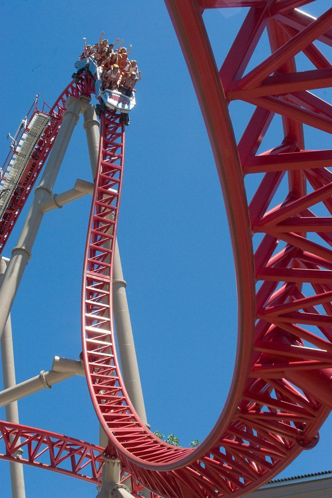
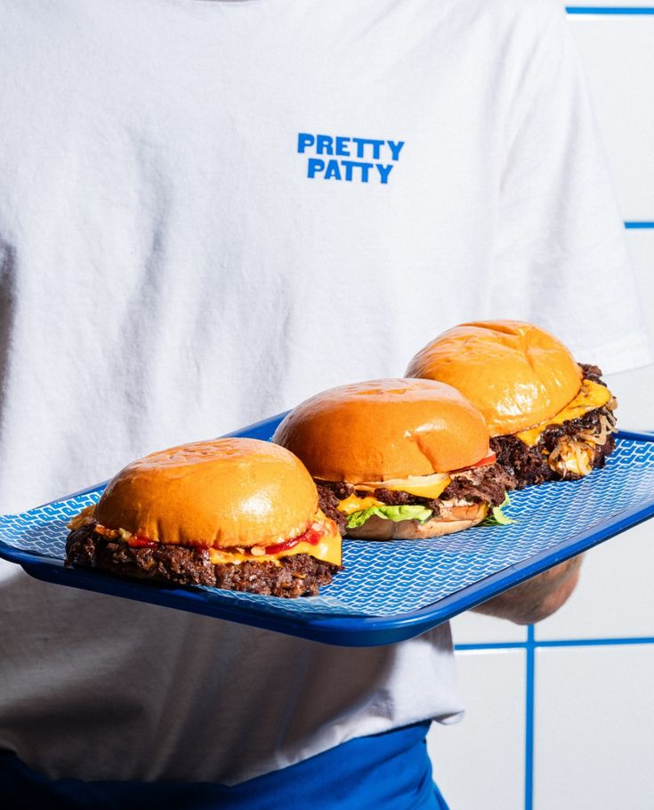

<div align="center">
  
  <br><br>
  
  <h1>🎢 Coastrack</h1>
  
  <p>
    <b>Keeping Thrill-Seekers Safe, Connected, and Engaged.</b>
  </p>

  [](https://www.python.org/)
  [](https://fastapi.tiangolo.com/)
  [](https://www.arduino.cc/)
  [-FF69B4.svg)](https://lmstudio.ai/)
</div>

<br>

Hey there! 👋 Welcome to **Coastrack**, the ultimate IoT & AI ecosystem designed to make theme parks a million times safer (and way more fun).

Ever felt that slight panic when you lose sight of your little sibling in a massive crowd? Or worried about how an intense rollercoaster might affect a family member with a heart condition? Yeah, me too. That's exactly why Coastrack was born.

We combined a **wearable smart wristband** (Arduino + Pulse Oximeter + GPS) with a slick **mobile web app** and a **local AI evaluator** to proactively monitor visitors. If something goes wrong, the AI spots it and alerts staff *before* it becomes a crisis.

---

## ✨ Why It's Awesome

* **❤️ Passive Health Monitoring:** A tiny wristband measures Heart Rate (BPM) and Oxygen (SpO2) continuously. No uncomfortable straps.
* **📍 Live GPS Tracking:** The wristband beams live coordinates straight to our frontend Leaflet.js map.
* **🤖 True "Local AI" Engine:** We hooked up **LM Studio (Google Gemma-4-e4b)** to our backend. It reads your age, health profile, and live pulse data. If your heart rate spikes abnormally compared to your profile, the AI autonomously triggers a `CRITICAL_ALERT`. No cloud, zero latency, total privacy.
* **🎮 Gamified Park Hub:** Not just for safety! Visitors use the app to check ride wait times, order burgers 🍔, or buy some cute plushies 🧸 without waiting in line.

---

## 📸 A Sneak Peek at the App

<div align="center">
  
  
  
</div>
<br>

*(The UI is built with Vanilla HTML/CSS/JS using a gorgeous Glassmorphism aesthetic. Smooth, responsive, and completely PWA-ready.)*

---

## 🛠️ The Tech Stack

I tried to keep things modern, fast, and local:

| Component | Tech Used | What It Does |
| :--- | :--- | :--- |
| **Frontend UI** | HTML / Vanilla CSS / Vanilla JS | Beautiful, hardware-accelerated animations. Glassmorphism styling. |
| **Mapping** | [Leaflet.js](https://leafletjs.com/) | Real-time GPS coordinate rendering without the pricey Google Maps API key. |
| **Backend API** | [FastAPI](https://fastapi.tiangolo.com/) + WebSockets | Ingests Bluetooth data, talks to AI, and blasts updates to the frontend with zero lag. |
| **AI Brain** | [LM Studio](https://lmstudio.ai/) | Runs `google/gemma-4-e4b` locally via an OpenAI-compatible REST endpoint. |
| **Hardware** | Arduino Nano, HC-06, MAX30102, NEO-7M | The physical smart wristband reading your pulse and talking to the satellites. |

---

## 🚀 Getting Started

If you want to run this beast on your own machine, it's pretty straightforward.

### 1. Fire up the AI (LM Studio)
1. Download [LM Studio](https://lmstudio.ai/) and load up the `google/gemma-4-e4b` model (or any model you prefer).
2. Start the **Local Inference Server** on port `1234`. Make sure CORS is enabled!

### 2. Start the Backend
1. Clone this repo.
2. Install the required Python packages:
   ```bash
   pip install fastapi uvicorn pyserial aiohttp
   ```
3. Boot up the FastAPI server:
   ```bash
   uvicorn main:app --reload --port 8000
   ```

### 3. Open the App
1. Go to `http://localhost:8000` in your browser.
2. Enter a mock profile, toggle a chronic illness, and hit **Save and Have Fun!**
3. Watch the AI analyze simulated (or real) hardware data in real-time. If the HR spikes past safe limits, brace yourself for the SOS screen!

---

## 🔌 Hardware Setup (The Arduino Part)
If you're actually building the wristband, check out the `coastrack_firmware.ino` file. Just remember: The HC-06 Bluetooth module communicates over Arduino's Hardware Serial (Pins D0 & D1). 
> **Crucial Tip:** *Unplug the Bluetooth TX/RX wires before uploading code to the Arduino, otherwise it will fail!*

---

### Let's build safer theme parks together! 🎡
Feel free to open an issue or submit a PR if you have wild ideas for gamification or better AI prompts. Have fun and ride safe!
